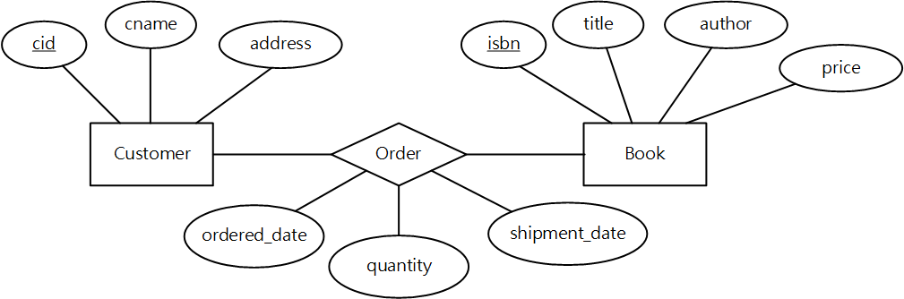

# ER Diagram Example

## Senerio

We want to design a book-ordering system.

- A customer has an id, a name, and an address.
- A book has an ISBN, a title, an author, and a price.
- A customer can place an order for a book.
- An order contains an ordered date, the quantity, and a shipment date.

## ER Model



There are some points you should notice:

- Ovals are attributes.
- Rectangles (along with ovals) are entity classes.
- Diamonds are relationships.
- Relationships may also have attributes.
- Primary keys are underlined.

## Relational Model

Here is an example to create coressponding relational schema.

```sql
CREATE TABLE Customers (
  cid     INTEGER,
  cname   VARCHAR(20),
  address VARCHAR(100),
  PRIMARY KEY (cid)
);
CREATE TABLE Books (
  isbn      VARCHAR(10),
  title     VARCHAR(50),
  author    VARCHAR(50),
  price     REAL,
  PRIMARY KEY (isbn)
);
CREATE TABLE Orders (
  cid       INTEGER,
  isbn      VARCHAR(10),
  ordered_date  Date,
  shipment_date Date,
  quantity      INTEGER,
  PRIMARY KEY (cid, isbn),
  FOREIGN KEY (cid) REFERENCES Customers,
  FOREIGN KEY (isbn) REFERENCES Books
);
```
